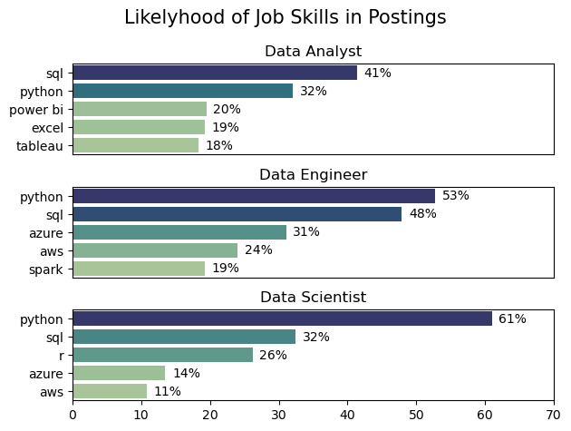

# The Analysis
## 1. What are the most demanded skills for the top 3 most popular data roles?
To find the most demanded skills for the 3 most popular data roles, I first filtered out the 3 data roles with the most job postings. Then I plotted them with their required skills. Each value shows the likelyhood of a skill being required for the respective job.

View my notebook with detailed steps:
[Skill_Demand.ipynb](Python_for_Data_Analytics_Course\03_Project_Section\Skill_Demand.ipynb)

### Visualize Data
```python
fig, ax = plt.subplots(len(job_titles), 1)

for i, job_title in enumerate(job_titles):
    df_plot = df_skill_perc[df_skill_perc['job_title_short'] == job_title].head()
    sns.barplot(data=df_plot, x='skill_perc',  y='job_skills', ax=ax[i], hue='skill_count', palette='crest')
    ax[i].set_ylabel("")
    ax[i].set_xlabel("")
    ax[i].legend().set_visible(False)
    ax[i].set_xlim(0,70)
    ax[i].set_title(job_title)
    for j, v in enumerate(df_plot['skill_perc']):
        ax[i].text(v+1, j, f'{v:.0f}%', va='center')

    if i != len(job_titles)-1:
        ax[i].set_xticks([])


fig.suptitle("Likelyhood of Job Skills in Postings", fontsize=15)
fig.tight_layout()
```
### Results


### Insights

- Python is a versatile skill, highly demanded across all three roles, but most promeinently for Data Scientists (72%) and Data Engineers (65%)
- SQL is the most requested skill for Data Analysts and also the second most requested for Data Engineers and Data Scientists

## 2. How are in-demand skills trending for Data Engineers?

### Visualize Data
```python
from matplotlib.ticker import PercentFormatter

df_plot = df_DE_Ger_percentage.iloc[:,:5]
sns.lineplot(df_plot, dashes=False, palette='Set2')
plt.title('Trending Top Skills for Data Engineers in Germany')
plt.ylabel('Likelyhood in Job Posting')
plt.xlabel('2023')
plt.legend().remove()
sns.despine()

ax=plt.gca()
ax.yaxis.set_major_formatter(PercentFormatter(decimals=0))

for i in range(5):
    col = df_plot.columns[i]
    y = df_plot.iloc[-1, i]

    if col.lower() == "python":
        y = y + 2
    elif col.lower() == "sql":
        y = y - 2

    plt.text(11.2, y, col)
```

### Results


### Insights 

- SQL and python remain the most consistently demanded skills throughout the year, although python shows a gradual decrease in demand
- azure shows a relatively stable demand throughout the year and is after python and sql the third most demanded skill over almost the whole year
- aws and spark also count towards the most demanded job skills for Data Engineers, eventhough they both show a gradal decrease over the year

## 3. How well do jobs and skills pay for Data Analysts?

### Salary Analysis

#### Visualize Data 

````python
sns.boxplot(data=job_ger_top5, x='salary_year_avg', y='job_title_short', order=job_order, palette='crest')
plt.title('Yearly Salary Comparison for Data Roles in India')
plt.xlabel('Yearly Salary (USD)')
plt.ylabel('')
plt.xlim(0, 300000)
plt.gca().xaxis.set_major_formatter(plt.FuncFormatter(lambda x, pos: f'${int(x/1000)}k'))
plt.show()
````

#### Results

 

### Highest Paid and Most Popular Skills for Data Analysts
#### Visualize Data

````python
# Top 10 Highest Paid Skills for Data Analysts (Germany)
sns.barplot(data=df_DA_top_pay, x='median', y=df_DA_top_pay.index, hue='median', ax=ax[0], palette='crest')
ax[0].legend().remove()
ax[0].set_title('Top 10 Highest Paid Skills for Data Analysts')
ax[0].set_ylabel('')
ax[0].set_xlabel('Median Salary (USD)')
ax[0].set_xlim(ax[0].get_xlim())
ax[0].xaxis.set_major_formatter(plt.FuncFormatter(lambda x, _: f'${int(x/1000)}K'))
````


#### Insights

- Senior and engineering roles pay more: Senior Data Scientists and (Senior) Data Engineers earn significantly more than Data Analysts; ML Engineers also show the widest salary range.
- Infrastructure and cloud skills command a premium: Terraform, BigQuery, Redshift, Kafka, and GCP are among the highest-paid skills, outperforming traditional analytics tools.
- Popularity does not equal pay: Python, Pandas, Excel, and SQL are the most common skills, but their median salaries are lower than those of specialized big-data and cloud skills.

## What is the most optimal skill to learn for Data Analyst?

#### Visualize Data

````python
from adjustText import adjust_text

sns.scatterplot(
    data=df_plot,
    x='skill_percent',
    y='median_salary',
    hue='technology'
)
````


#### Insights
- High Demand vs. High Pay: SQL and Python are the most frequently required skills, appearing in approximately 38% to 50% of job postings, though they offer mid-range median salaries compared to niche technologies.

- Lucrative Niche Skills: Tools like GitHub and GCP (Google Cloud Platform) represent "high-value" niches; they appear in a smaller percentage of jobs (under 10%) but are associated with the highest median salaries, reaching up to $200k.

- Dominant Toolsets: Analyst tools like Tableau and Excel maintain a strong presence in the market (between 15% and 30%), serving as a middle ground with stable demand and salaries around the $100k mark.
