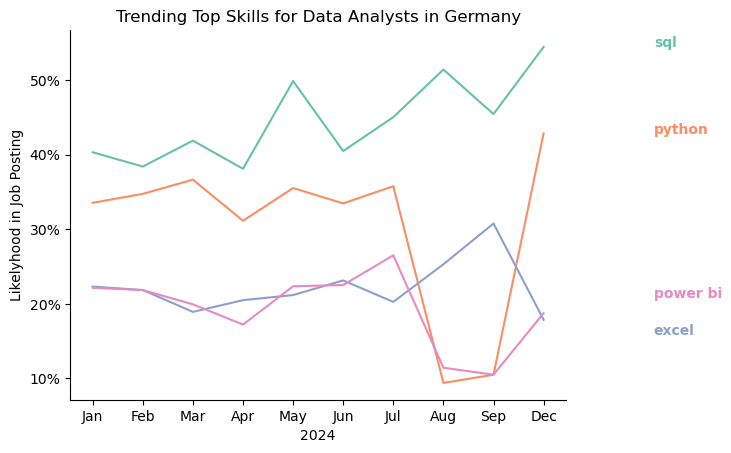
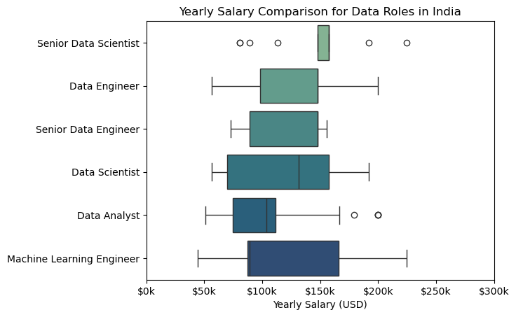
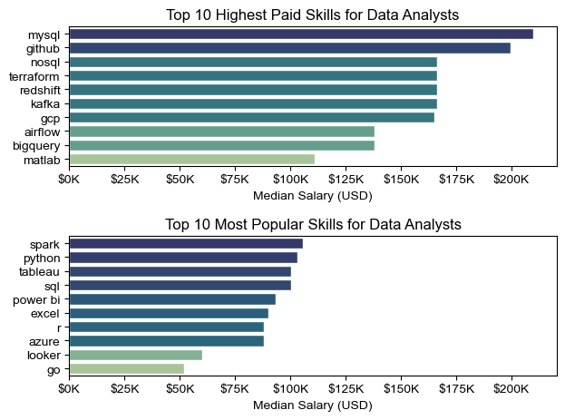
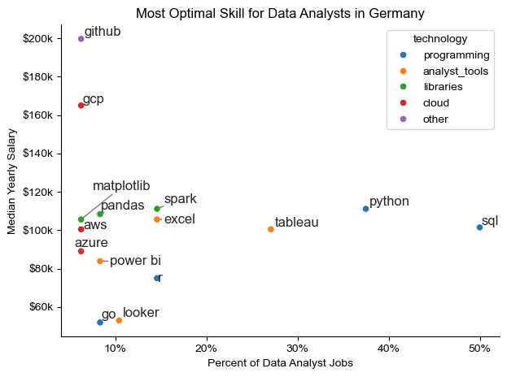

# Overview
Welcome to my analysis of the data job market, focusing on data analyst roles. This project was created out of a desire to navigate and understand the job market more effectively. It delves into the top-paying and in-demand skills to help find optimal opportunities for Data Analysts.

The data is sourced from [Luke Barousse's Python Course](https://www.lukebarousse.com/products/python-for-data-analytics) which provides a foundation for my analysis, containing detailed information on job titles, salary trends and the intersection of demand and salary in data analytics.

# The Questions
Below are the questions I want to answer in my project:
1. What are the skills most in demand for the top 3 most popular data roles?
2. How are in-demand skills trending for Data Analysts?
3. How well do jobs and skills pay for Data Analysts?
4. What are the optimal skills for data analysts to learn (High Demand and High Paying)

# Tools I used

For my deep dive into the data analyst job market, I harnessed the power of several key tools:
- **Python**: The backbone of my analysis, allowing me to analyze the data and find critical insights. I also used the following python libraries:
    - **Pandas Library**: This was used to analyze the data.
    - **Matplotlib Library**: I visualized the data.
    - **Seaborn Library**: Helped me create more advanced visuals.
- **Jupyter Notebooks**: The tool I used to run my python scripts which let me easily include my notes and analysis.
- **Visual Studio Code**: My go-to for executing Python scripts.
- **Git & Github**: Essential for version control and sharing my Python code and analysis.

# Data Preparation and Cleanup
This section outlines the steps taken to prepare the data for analysis, ensuring accuracy and usability.

## Import & Clean Up Data

I start by importing necessary libraries and loading the dataset, followed by initial data cleaning tasks to ensure data quality.

```python
# Importing Libraries
import ast
import pandas as pd
import seaborn as sns
from datasets import load_dataset
import matplotlib.pyplot as plt  

# Loading Data
dataset = load_dataset('lukebarousse/data_jobs')
df = dataset['train'].to_pandas()

# Data Cleanup
df['job_posted_date'] = pd.to_datetime(df['job_posted_date'])
df['job_skills'] = df['job_skills'].apply(lambda x: ast.literal_eval(x) if pd.notna(x) else x)
```

## Filter German Jobs

To focus my analysis on the German job market, I applied filters to the dataset, narrowing down to roles based in Germany.

```python
df_Ger = df[df['job_country'] == 'Germany']
```


# The Analysis
## 1. What are the most demanded skills for the top 3 most popular data roles?
To find the most demanded skills for the 3 most popular data roles, I first filtered out the 3 data roles with the most job postings. Then I plotted them with their required skills. Each value shows the likelyhood of a skill being required for the respective job.

### Visualize Data
```python
fig, ax = plt.subplots(len(job_titles), 1)

for i, job_title in enumerate(job_titles):
    df_plot = df_skill_perc[df_skill_perc['job_title_short'] == job_title].head()
    sns.barplot(data=df_plot, x='skill_perc',  y='job_skills', ax=ax[i], hue='skill_count', palette='crest')
    ax[i].set_ylabel("")
    ax[i].set_xlabel("")
    ax[i].legend().set_visible(False)
    ax[i].set_xlim(0,70)
    ax[i].set_title(job_title)
    for j, v in enumerate(df_plot['skill_perc']):
        ax[i].text(v+1, j, f'{v:.0f}%', va='center')

    if i != len(job_titles)-1:
        ax[i].set_xticks([])


fig.suptitle("Likelyhood of Job Skills in Postings", fontsize=15)
fig.tight_layout()
```
### Results


### Insights

- SQL is the foundation: It is the most requested skill for Data Analysts (41%) and the second most for Data Engineers (48%), making it essential for entry into the field.
- Python dominance in Data Science: 61% of Data Scientist job postings require Python, significantly higher than the 32% for SQL and 26% for R.
- Cloud for Engineers: Data Engineering roles prioritize Azure (31%) and AWS (24%) much more than Analyst or Scientist roles, reflecting the focus on infrastructure.


## 2. How are in-demand skills trending for Data Analysts?

To find how skills are trending in 2023 for Data Analysts, I filtered data analyst positions and grouped the skills by the month of the job postings. This got me the top 5 skills of data analysts by month, showing how popular skills were throughout 2023.


### Visualize Data
```python
from matplotlib.ticker import PercentFormatter

df_plot = df_DE_Ger_percentage.iloc[:,:5]
sns.lineplot(df_plot, dashes=False, palette='Set2')
plt.title('Trending Top Skills for Data Engineers in Germany')
plt.ylabel('Likelyhood in Job Posting')
plt.xlabel('2023')
plt.legend().remove()
sns.despine()

ax=plt.gca()
ax.yaxis.set_major_formatter(PercentFormatter(decimals=0))

for i in range(5):
    col = df_plot.columns[i]
    y = df_plot.iloc[-1, i]

    if col.lower() == "python":
        y = y + 2
    elif col.lower() == "sql":
        y = y - 2

    plt.text(11.2, y, col)
```

### Results



### Insights 

- Dominance of SQL and Python: SQL and Python consistently remain the top two skills throughout 2024, with SQL ending the year as the most sought-after skill at over 50% likelihood.
- Excel's Volatility: Demand for Excel shows significant fluctuations, peaking in September before experiencing a sharp decline to under 20% by December.
- Power BI Recovery: Despite a major dip in August, Power BI shows signs of stabilization toward the end of the year, finishing December nearly neck-and-neck with Excel.

## 3. How well do jobs and skills pay for Data Analysts?

To identify the highest-paying roles and skills, I only got jobs in Germany and looked at their median salary. But first I looked at the salary distributions of common data jobs like Data Scientist, Data Engineer, and Data Analyst, to get an idea of which jobs are paid the most. 


### Visualize Data 

````python
sns.boxplot(data=job_ger_top5, x='salary_year_avg', y='job_title_short', order=job_order, palette='crest')
plt.title('Yearly Salary Comparison for Data Roles in India')
plt.xlabel('Yearly Salary (USD)')
plt.ylabel('')
plt.xlim(0, 300000)
plt.gca().xaxis.set_major_formatter(plt.FuncFormatter(lambda x, pos: f'${int(x/1000)}k'))
plt.show()
````

### Results

 


### Insights

- ML Engineers lead the pack: Machine Learning Engineers have the highest upper-quartile potential, with salaries stretching toward $225k.
- Seniority doesn't guarantee the highest peak: While Senior Data Scientists have a high median (around $150k), the spread of Data Scientist roles shows more extreme high-end outliers.
- Analyst Floor: Data Analysts have the lowest median salary (approx. $100k) and the tightest distribution, indicating a more standardized and lower-ceiling pay scale compared to Engineering roles.

## 4. Highest Paid and Most Popular Skills for Data Analysts

Next, I narrowed my analysis and focused only on data analyst roles. I looked at the highest-paid skills and the most in-demand skills. I used two bar charts to showcase these.

### Visualize Data

````python
# Top 10 Highest Paid Skills for Data Analysts (Germany)
sns.barplot(data=df_DA_top_pay, x='median', y=df_DA_top_pay.index, hue='median', ax=ax[0], palette='crest')
ax[0].legend().remove()
ax[0].set_title('Top 10 Highest Paid Skills for Data Analysts')
ax[0].set_ylabel('')
ax[0].set_xlabel('Median Salary (USD)')
ax[0].set_xlim(ax[0].get_xlim())
ax[0].xaxis.set_major_formatter(plt.FuncFormatter(lambda x, _: f'${int(x/1000)}K'))
````
### Results



### Insights

- Niche pays better: The highest-paid skills (MySQL at $200k+, GitHub, NoSQL) are not the same as the most popular skills, indicating that specialized technical knowledge commands a premium.
- The "Popularity Gap": The most popular skills like Spark and Python have median salaries around $100k, which is nearly 50% lower than the top-tier technical niches.
- Legacy tools pay less: General-purpose tools like "Go" and "Looker" sit at the bottom of the popular salary list, falling significantly below the $75k mark.

## What is the most optimal skill to learn for Data Analyst?

To identify the most optimal skills to learn ( the ones that are the highest paid and highest in demand) I calculated the percent of skill demand and the median salary of these skills. To easily identify which are the most optimal skills to learn. 

### Visualize Data

````python
from adjustText import adjust_text

sns.scatterplot(
    data=df_plot,
    x='skill_percent',
    y='median_salary',
    hue='technology'
)
````

### Result



### Insights

- High demand & High pay: Python and SQL are the most "optimal" because they sit in the top right quadrant—high market demand (40%+) and high median salaries ($100k+).
- The Library Advantage: "Pandas" and "Spark" offer the highest median yearly salaries (exceeding $105k) despite appearing in fewer than 15% of job postings.
- Tool Oversaturation: Analyst tools like Excel and Power BI are common in jobs but generally result in lower median salaries compared to programming-heavy skills.

# What I Learned

Throughout this project, I deepened my understanding of the data analyst job market and enhanced my technical skills in Python, especially in data manipulation and visualization. Here are a few specific things I learned:

- **Advanced Python Usage**: Utilizing libraries such as Pandas for data manipulation, Seaborn and Matplotlib for data visualization, and other libraries helped me perform complex data analysis tasks more efficiently.
- **Data Cleaning Importance**: I learned that thorough data cleaning and preparation are crucial before any analysis can be conducted, ensuring the accuracy of insights derived from the data.
- **Strategic Skill Analysis**: The project emphasized the importance of aligning one's skills with market demand. Understanding the relationship between skill demand, salary, and job availability allows for more strategic career planning in the tech industry.


# Insights

This project provided several general insights into the data job market for analysts:

- **Skill Demand and Salary Correlation**: There is a clear correlation between the demand for specific skills and the salaries these skills command. Advanced and specialized skills like Python and Oracle often lead to higher salaries.
- **Market Trends**: There are changing trends in skill demand, highlighting the dynamic nature of the data job market. Keeping up with these trends is essential for career growth in data analytics.
- **Economic Value of Skills**: Understanding which skills are both in-demand and well-compensated can guide data analysts in prioritizing learning to maximize their economic returns.


# Challenges I Faced

This project was not without its challenges, but it provided good learning opportunities:

- **Data Inconsistencies**: Handling missing or inconsistent data entries requires careful consideration and thorough data-cleaning techniques to ensure the integrity of the analysis.
- **Complex Data Visualization**: Designing effective visual representations of complex datasets was challenging but critical for conveying insights clearly and compellingly.
- **Balancing Breadth and Depth**: Deciding how deeply to dive into each analysis while maintaining a broad overview of the data landscape required constant balancing to ensure comprehensive coverage without getting lost in details.


# Conclusion

This exploration into the data analyst job market has been incredibly informative, highlighting the critical skills and trends that shape this evolving field. The insights I got enhance my understanding and provide actionable guidance for anyone looking to advance their career in data analytics. As the market continues to change, ongoing analysis will be essential to stay ahead in data analytics. This project is a good foundation for future explorations and underscores the importance of continuous learning and adaptation in the data field.
